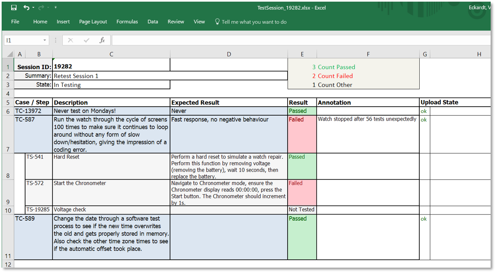
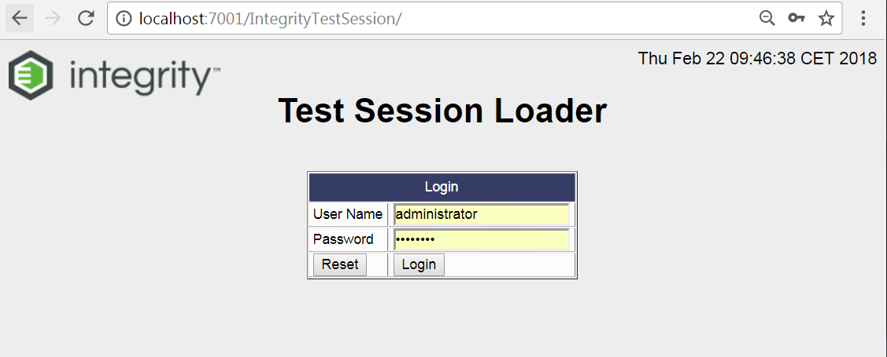
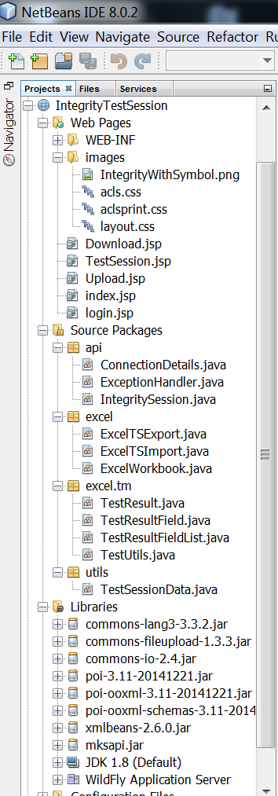

# Integrity Test Session
Offers the download and upload of Test Cases, Test Steps and Results from Integrity to Excel. It's the Web only solution, you don't have to install any client tool. The implementation is done using JSPs and Java, which will finally be compiled to Servlets.
Although it's a server process, I assume that the workload for a server is very similar to a local java program.

Please see this solution as a try out how a fully server based program can be developed in combination with Integrity. It can be seen as a prototype for this kind of solutions like data loader, smaller batch jobs with user interaction, etc.  

HINT: there is a similar local app available, please see project "IntegrityExcelTestSession"

## Use Cases
- Offline Test Result editor in Excel
- Entering Test Results just with a Tablet PC (without Integrity Client installed)
- Open Point: Option, to select "Full test session export" or just the "remaining open test cases"

## Install
- Put the "dist/IntegrityTestSession.war" directly into your "<IntegrityServer>/server/mks/deploy" folder
- Put the "doc/TestSessionTemplate.xlsx" directly into your "<IntegrityServer>/public_html" folder
- Create a Query "My Active Test Sessions" that should return the "In Testing" state Test Sessions assigned to me

## Template
The Template file (see doc/TestSessionTemplate.xlsx) can be tailord for your needs

## How to test
Part 1: Download
- open http://localhost:7001/IntegrityTestSession
- select the Test Session that you want to export
- Start the Download with a click at the [Download] button
- Then review the download log

Part 2: Upload
- open http://localhost:7001/IntegrityTestSession
- Select the Upload tab
- Select the file to upload
- Start the Import with a click at the [Load] button
- Then review the upload log

## Log File and Debug
In case of issues please check the server log

##  Development environment
- PTC Integrity 11.1
- Netbeans 8.0.2
- Java 1.8

## Known Limitations
- This application does not support Test Case images to display. The Test Case text downloaded is always plain text only.

## Some Screenshots

{:width="400px"}

## Configuration

## Dev Structure

