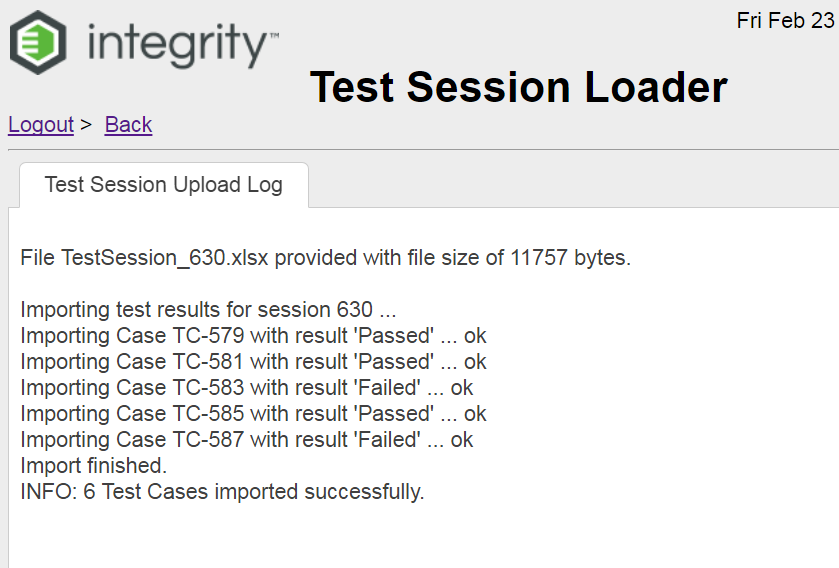

# Integrity Test Session
Offers the download and upload of Test Cases, Test Steps and Results stored in Excel (Web only Solution).
HINT: there is a similar local app available, please see project "IntegrityExcelTestSession"

## Use Cases
- Offline Test Result editor in Excel
- Open Point: Full test session export or just the remainin open test results

## Install
- Put the "dist/IntegrityExcelUpload.war" directly into your "<IntegrityServer>/server/mks/deploy" folder
- Put the "doc/TestSessionTemplate.xlsx" directly into your "<IntegrityServer>/public_html" folder

## Template
The Template file (see doc/TestSessionTemplate.xlsx) can be tailord for your needs

## How to test
Part 1: Download
- open http://localhost:7001/IntegrityTestSession
- select the Test Session that you want to export
- Start the Download with a click at the [Download] button
- Then review the download log

Part 2: Upload
- open http://localhost:7001/IntegrityTestSession
- Select the Upload tab
- Select the file to upload
- Start the Import with a click at the [Load] button
- Then review the upload log

## Log File and Debug
In case of issues please check the server log

##  Development environment
- PTC Integrity 11.1
- Netbeans 8.0.2
- Java 1.8

## Known Limitations
- This local application does not support images to display. The Test Case text downloaded is always plain text only.

## Some Screenshots

## Configuration

## Dev Structure

